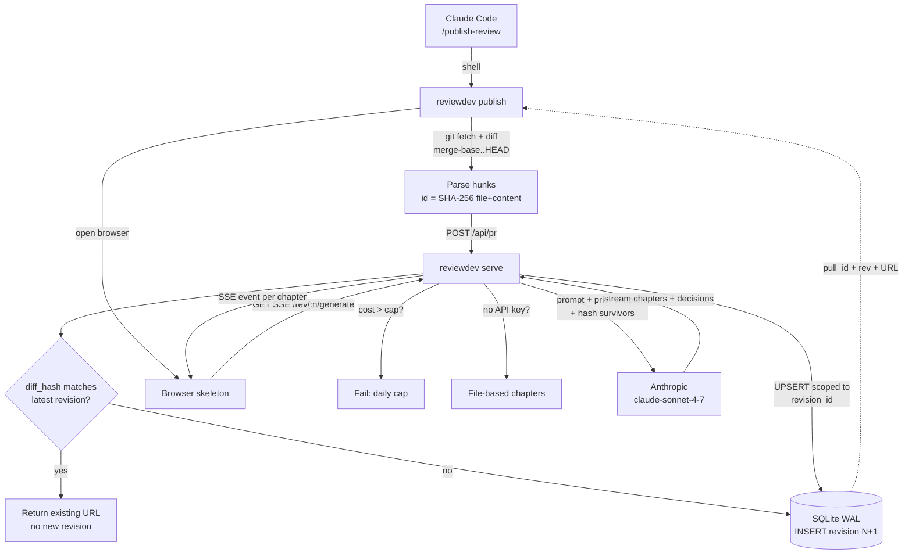
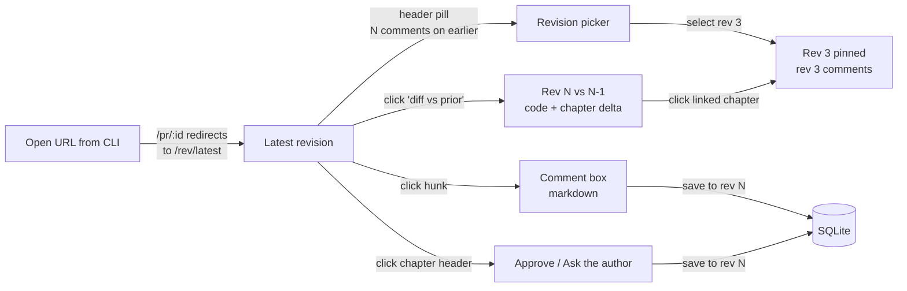
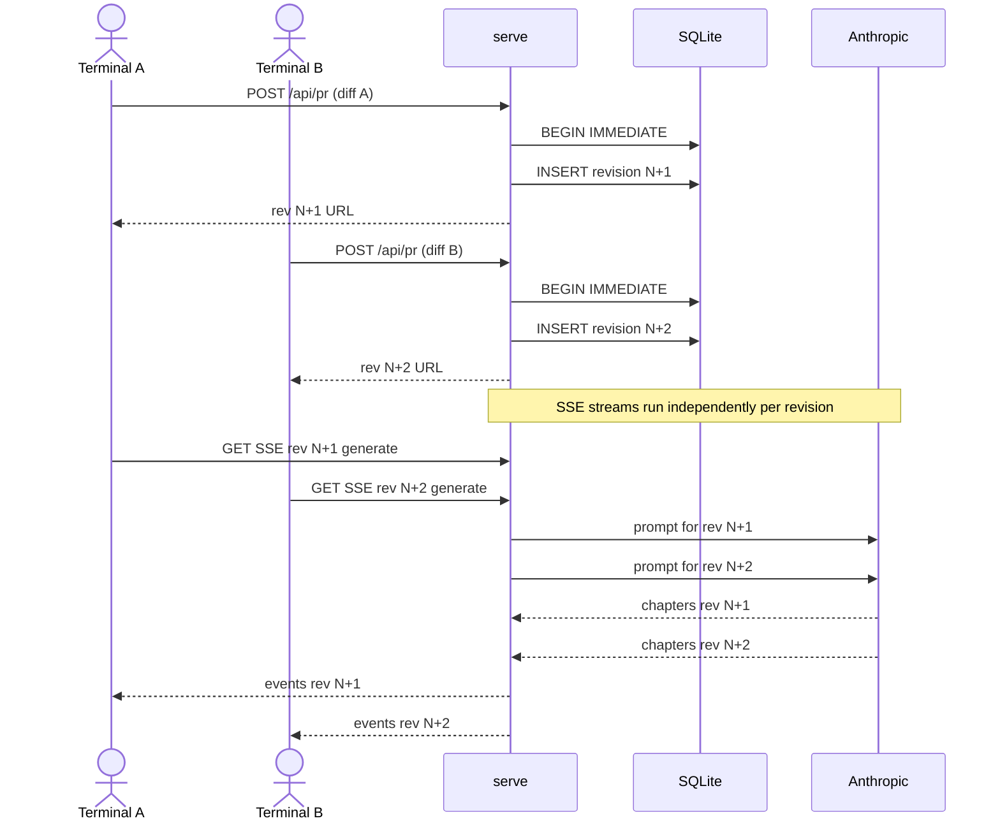
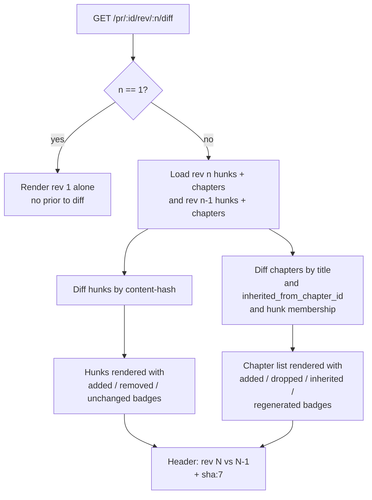

# review.dev MVP — Design Diagrams

Generated by `/plan visualize` on 2026-05-17 (Draft 4 refresh — revisions-as-PRs model). Companion to [SPEC.md](../../../SPEC.md).

State-machine diagram from the prior version is removed: under the revisions-as-PRs model, nothing in the system has meaningful state transitions. Revisions are immutable once created; chapters are immutable within a revision.

## Data Flow — publish pipeline



### Notes
- **Duplicate detection.** `diff_hash` over the sorted set of hunk ids. If a re-publish hashes identically to the latest revision, no new row is inserted — `publish` just returns the existing URL.
- **Inheritance hint.** The prompt to Anthropic includes (a) the prior revision's chapter titles + (b) which of its hunks survived to this revision by content hash. Instructs the model to reuse titles/groupings where every underlying hunk is unchanged.
- **No supersedes.** Two overlapping publishes both succeed and each get their own SSE stream — independent revisions, no cancellation.
- **Writers.** `reviewdev publish` writes the revision row + hunks + sessions. `reviewdev serve` (SSE handler) writes chapters + decisions + usage. The two never contend.

## User Flow — viewing a PR with multiple revisions



### Notes
- **Default landing.** `/pr/:id` redirects to `/pr/:id/rev/<latest>`. Old browser tabs pin to whatever revision was current when they opened.
- **Header pill.** Surfaces comments left on earlier revisions without migrating them. One click → revision picker.
- **Diff view.** Always rev N vs N-1 in v1. Diffing arbitrary pairs is P1.6.
- **Comments and approvals.** Always written to the revision the user is currently viewing — no implicit migration.

## Sequence — concurrent publishes both succeed

Replaces the prior "supersedes" sequence. Under Draft 4 every publish is its own revision, so concurrency is trivially safe.



### Notes
- **Order is commit-order, not call-order.** `BEGIN IMMEDIATE` serialises the two inserts; whichever commits first becomes N+1, the other becomes N+2. Both readable, both queryable.
- **No shared mutable state.** Each SSE stream serves a different `revision_id`, so the LLM calls and DB writes don't intersect.
- **Cost accounting.** Each LLM call writes its own `usage` row independently. Daily-cap check happens per call.

## Revision diff view — what `/pr/:id/rev/:n/diff` renders



### Notes
- **Hunk delta.** Pure set comparison on content-hash ids — `in N \ in N-1`, `in N-1 \ in N`, intersection. Same hash in both = "unchanged" (rendered greyed out).
- **Chapter delta.** Four classes:
  - **Added** — new chapter in N (`inherited_from_chapter_id IS NULL` and title not in N-1).
  - **Inherited** — `inherited_from_chapter_id IS NOT NULL`. Title + grouping reused. Linked back to source chapter in N-1.
  - **Regenerated** — same title in N-1 but `chapter_hunks` membership differs. The LLM decided the grouping was no longer right.
  - **Dropped** — chapter in N-1 with no corresponding chapter in N (no inheritance pointer back).
- **No comment delta.** Comments are revision-scoped — there's no notion of "comment that survived from N-1." The chapter delta carries enough signal about what changed.
- **n=1 fallback.** No prior revision exists; the route renders the same view as `/pr/:id/rev/1` with no badges.

---

## Summary

```
Diagrams written to .claude/specs/review-dev-mvp/diagrams.md
  Data Flow (publish pipeline):    ✓ validated
  User Flow (revision navigation): ✓ validated
  Sequence (concurrent publishes): ✓ validated  (replaces supersedes)
  Flowchart (revision diff view):  ✓ validated  (new)
  State Machine:                   removed — nothing has state transitions under Draft 4
```

Spec + diagrams are now consistent at Draft 4. Next step: `/new-spec review-dev-mvp` to scaffold `requirements.md` / `design.md` / `tasks.md` and then `/execute`.
